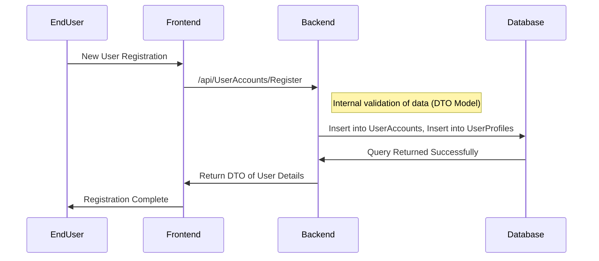

# ASP&#46;NET API Specification v0.1

**Repo URL:**`https://github.com/Magutamba/Team_10_Group_Project`

**Author:** `Lorenzo Moares Nunez - 23378441`

---

## &#46;NET Version

- &#46;NET 10.0

- ASP&#46;NET Core Runtime 10.0

### Packages

- BCrypt&#46;Net-Next 4.0.3

- Microsoft.AspNetCore.Authentication.JwtBearer 10.0.3

- Microsoft.AspNetCore.OpenApi 10.0.2

- Microsoft.EntityFrameworkCore 10.0.2

- Microsoft.EntityFrameworkCore.Design 10.0.2

- Microsoft.EntityFrameworkCore.Tools 10.0.2

- Microsoft.IdentityModel.Tokens 8.16

- Microsoft.VisualStudio.Web.CodeGeneration.Design 10.0.2

- Npgsql.EntityFrameworkCore.PostgreSQL 10.0

- Swashbuckle.AspNetCore 10.1.2

- System.IdentityModel.Tokens.Jwt 8.16

### Setup

> **NOTE:** In order to run this project several Entity Framework commands need to be executed. Installing Entity Framework `dotnet tool update --global dotnet-ef`

- Insert your specific PostgreSQL details into appsettings.json - ConnectionStrings : DefaultConnection

- `dotnet restore`, `dotnet clean`, `dotnet build` in-order may be required to rebuild project files that are ignored via Git

- `dotnet ef migrations add "InitialCreate"` creates a payload of the current model context

- `dotnet ef database update` sends that payload to desired PostgreSQL database to create/associate tables using Entity Framework

- `dotnet run` will start the backend service

> **NOTE:** Ensure that the terminal is pointing to the correct directory `../Team_10_Group_Project/ContractDevApi/ContractDevApi/.`

## End-Point Behavior

### Authentication

All endpoints require a JWT Bearer Token - Exception: `Registration & Login`

- **Header:** `Authorization: Bearer <TOKEN>`

#### JSON Web Token

> **Example:** `eyJhbGciOiJIUzI1NiIsInR5cCI6IkpXVCJ9.eyJzdWIiOiIxIiwi...`

| Claims Table | Value                                                                | Description                                                                       |
| ------------ | -------------------------------------------------------------------- | --------------------------------------------------------------------------------- |
| sub          | 1                                                                    | The subject of the JWT (the user)                                                 |
| email        | test@example.com                                                     | The email associated to the subject                                               |
| exp          | 1771699191 (Sat Feb 21 2026 18:39:51 GMT+0000 (Greenwich Mean Time)) | The expiration time on or after which the JWT MUST NOT be accepted for processing |
| iss          | http://localhost:7186                                                | The issuer of the JWT (Backend ASP&#46;NET API)                                   |
| aud          | http://localhost:4200                                                | The recipient that the JWT is intended for (Frontend Angular Webserver)           |

---

### HTTP Methods

| Address                          | Method | Description                                                   | Validation                                                                               | Authorization             | FromForm DTO         |
| -------------------------------- | ------ | ------------------------------------------------------------- | ---------------------------------------------------------------------------------------- | ------------------------- | -------------------- |
| /api/UserProfiles/ProfileGallery | GET    | Retrieves select data for all user profiles - profile gallery | Token format validation                                                                  | Bearer Token              | N/A                  |
| /api/UserProfiles/ProfileDetails | GET    | Retrieves user profile                                        | Cross-Reference `sub` claim with `DTO.Id` to prevent IDOR attacks                        | Bearer Token (Owner Only) | [FromQuery] Id : int |
| /api/UserAccounts/Register       | POST   | Creates new entries in User and Profile tables                | Model validation (FluentValidation for email format and password matching confirmation)  | Anonymous                 | UserRegistrationDto  |
| /api/UserAccounts/Login          | POST   | Authenticates credentials and returns a JWT                   | Model validation, valid email/password combination                                       | Anonymous                 | UserLoginDto         |
| /api/UserAccounts/Validate       | POST   | Swagger UI development validation                             | Token format verification                                                                | Bearer Token              | N/A                  |
| /api/UserAccounts/ChangePassword | PUT    | Updates user credentials                                      | Cross-Reference `sub` claim with `DTO.Id` to prevent IDOR attacks                        | Bearer Token (Owner Only) | UserPasswordDto      |
| api/UserAccounts/Recovery        | PUT    | Updates user credentials                                      | Model Validation (FluentValidation for email formate and password matching confirmation) | Anonymous                 | UserRecoveryDto      |
| /api/UserProfiles/UpdateProfile  | PUT    | Updates user profile                                          | Cross-Reference `sub` claim with `DTO.Id` to prevent IDOR attacks                        | Bearer Token (Owner Only) | ProfileUpdateDto     |
| api/UserProfiles/UploadFile      | PUT    | Updates user profile picture                                  | Cross-Reference `sub` claim with `DTO.Id` to prevent IDOR attacks                        | Bearer Token (Owner Only) | ProfileUploadDto     |
| /api/UserAccounts/Delete         | DELETE | Deletes user information from database                        | Cross-Reference `sub` claim with `DTO.Id` to prevent IDOR attacks                        | Bearer Token (Owner Only) | UserDeletionDto      |

### Data Transfer Objects

| DTO Name            | Properties                                                                                                                                                                                                                                                                                                                                                                                                                                                                                                                                                                |
| ------------------- | ------------------------------------------------------------------------------------------------------------------------------------------------------------------------------------------------------------------------------------------------------------------------------------------------------------------------------------------------------------------------------------------------------------------------------------------------------------------------------------------------------------------------------------------------------------------------- |
| UserRegistrationDto | `Username : string`, `FirstName : string`, `LastName : string`, `Country : string`, `Description : string`, `Email : string`, `Password : string`, `ConfirmPassword : string`, `SecurityQuestion : string`, `SecurityAnswer : string`                                                                                                                                                                                                                                                                                                                                     |
| UserLoginDto        | `Email : string`, `Password : string`                                                                                                                                                                                                                                                                                                                                                                                                                                                                                                                                     |
| ProfileUpdateDto    | `Id : int`, `Username : string-nullable`, `Email : string-nullable`, `PhoneNumber : string-nullable`, `Country : string-nullable`, `Description : string-nullable`, `UserTitle : string-nullable`, `Bio : string-nullable`, `AvailableForWork : bool-nullable`, `OfferingWork : bool-nullable`, `DisplayUsername : bool-nullable`, `HidePhoneNumber : bool-nullable`, `FacebookLink : string-nullable`, `UserSocialEmailLink : string-nullable`, `XLink : string-nullable`, `GithubLink : string-nullable` , `LinkedinLink : string-nullable` , `Skills` : `List<string>` |
| UserPasswordDto     | `Id : int`, `OldPassword : string`, `NewPassword : string`, `ConfirmNewPassword : string`, `SecurityAnswer : string`                                                                                                                                                                                                                                                                                                                                                                                                                                                      |
| ProfileUploadDto    | `Id : int`, `File : IFormFile`                                                                                                                                                                                                                                                                                                                                                                                                                                                                                                                                            |
| UserRecoveryDto     | `Email : string`, `SecurityQuestion : string`, `SecurityAnswer : string`, `NewPassword : string`, `ConfirmNewPassword : string`                                                                                                                                                                                                                                                                                                                                                                                                                                           |
| UserDeletionDto     | `Id : int`, `Password : string`, `SecurityAnswer : string`                                                                                                                                                                                                                                                                                                                                                                                                                                                                                                                |

### Error Responses

- **Error:** Invalid data will return `400 Bad Request`

- **Error:** Unauthenticated requests will return `401 Unauthorized`

- **Error:** Unauthorized requests will return `403 Forbidden`

- **Error:** Requested data not found `404 Not Found`

- **Error:** Request limit exceeded `429 Too Many Requests`

- **Error:** Updating database failed `500 Internal Server Error`

> **Note:** All valid requests are returned with status code `200 Ok`

### Sample Interaction (New User Registration)

## Swagger UI

> **Note:** Swagger UI is restricted to the `Development` environment and is not accessible in `Production` (AWS) to minimize the attack surface.

The backend provides an interactive **OpenAPI (Swagger)** interface for manual endpoint discovery and testing.

- **Endpoint:** `https://localhost:7186/swagger`

- **Authentication:** Swagger is configured with a **JWT Security Scheme Definition**. To test protected endpoints:

1. Obtain a token via the `Login` endpoint.

2. Click the **Authorize** lock icon🔒 in Swagger.

3. Enter the token in the format: `Bearer <TOKEN>` or `<TOKEN>`

### Debugging Tools

| Tool            | Route                      | Purpose                                                                                  |
| --------------- | -------------------------- | ---------------------------------------------------------------------------------------- |
| Swagger UI      | /swagger                   | Manual endpoint execution and schema inspection                                          |
| Token Validator | /api/UserAccounts/Validate | Health Check - verifies that stored JWT is still cryptographically valid and not expired |
